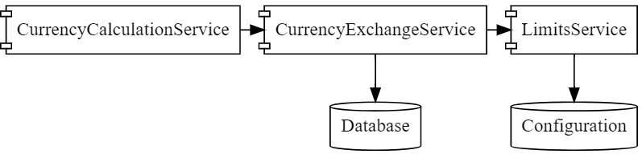
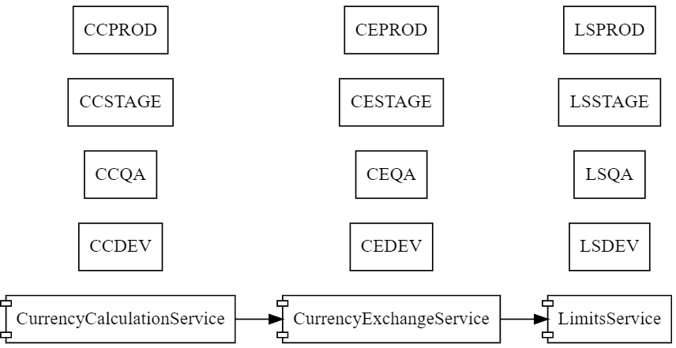
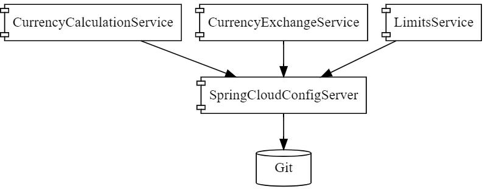
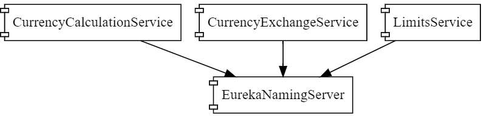
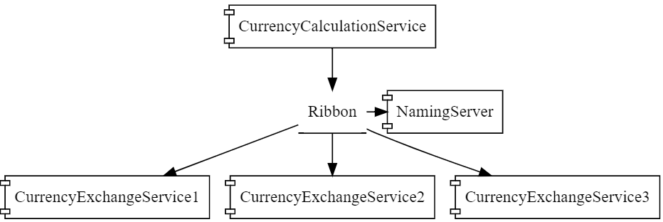
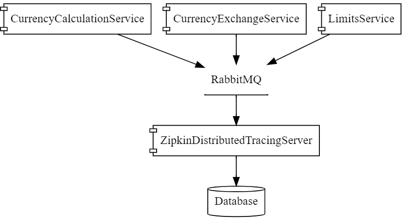
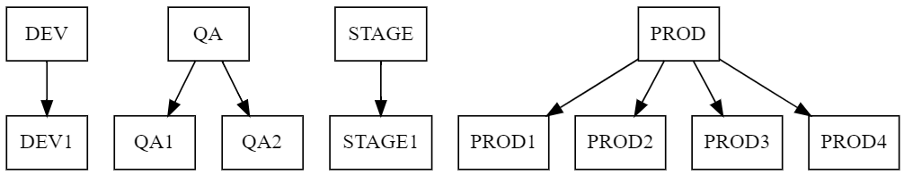
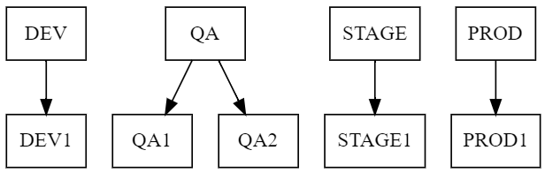

# Microservices with Spring Boot and Spring Cloud
This repository contains microservices projects from Microservices with Spring Boot and Spring Cloud course by in28Minutes.
## Versions
- 2.0.0.RELEASE
- Finchley.M8

## URLs

|     Application       |     URL          |
| ------------- | ------------- |
| Limits Service | http://localhost:8080/limits|
| Spring Cloud Config Server| http://localhost:8888/limits-service/default http://localhost:8888/limits-service/dev|
| Currency Converter Service - Direct Call| http://localhost:8100/currency-converter/from/USD/to/INR//usr/local/var/log/rabbitmq/rabbit@localhost.log/usr/local/var/log/rabbitmq/rabbit@localhost.logquantity/10|
|  Currency Converter Service - Direct Call| http://localhost:8100/currency-converter/from/USD/to/INR/quantity/10 (without rabbitMQ)|
| Currency Converter Service - Feign| http://localhost:8100/currency-converter-feign/from/EUR/to/INR/quantity/10000|
| Currency Exchange Service | http://localhost:8000/currency-exchange/from/EUR/to/INR http://localhost:8001/currency-exchange/from/USD/to/INR|
| Eureka | http://localhost:8761/|
| Zuul - Currency Exchange & Exchange Services | http://localhost:8765/currency-exchange-service/currency-exchange/from/EUR/to/INR http://localhost:8765/currency-conversion-service/currency-converter-feign/from/USD/to/INR/quantity/10|
| Zipkin | http://localhost:9411/zipkin/ |
| Spring Cloud Bus Refresh | http://localhost:8080/actuator/bus-refresh (POST)|

## Zipkin Installation

Quick Start Page
- https://zipkin.io/pages/quickstart

Downloading Zipkin Jar
- https://search.maven.org/remote_content?g=io.zipkin.java&a=zipkin-server&v=LATEST&c=exec

Command to run
```
RABBIT_URI=amqp://localhost java -jar zipkin-server-2.12.9-exec.jar 
```

## VM Argument

-Dserver.port=8001

## Ports

|     Application       |     Port          |
| ------------- | ------------- |
| Limits Service | 8080, 8081, ... |
| Spring Cloud Config Server | 8888 |
|  |  |
| Currency Exchange Service | 8000, 8001, 8002, ..  |
| Currency Conversion Service | 8100, 8101, 8102, ... |
| Netflix Eureka Naming Server | 8761 |
| Netflix Zuul API Gateway Server | 8765 |
| Zipkin Distributed Tracing Server | 9411 |

## Diagrams
### Microservices Communication


### Microservices Environments


### Spring Cloud Config Server


### Eureka Naming Server


### Ribbon Client Side Load Balancing


### Zipkin Distributed Tracing Server


### Currency Exchange Microservice Deployment


### Currency Conversion Microservice Deployment


## More Reading about Microservices
- Design and Governance of Microservices
    - https://martinfowler.com/microservices/
- 12 Factor App 
    - https://12factor.net/
    - https://dzone.com/articles/the-12-factor-app-a-java-developers-perspective
- Spring Cloud
    - http://projects.spring.io/spring-cloud/